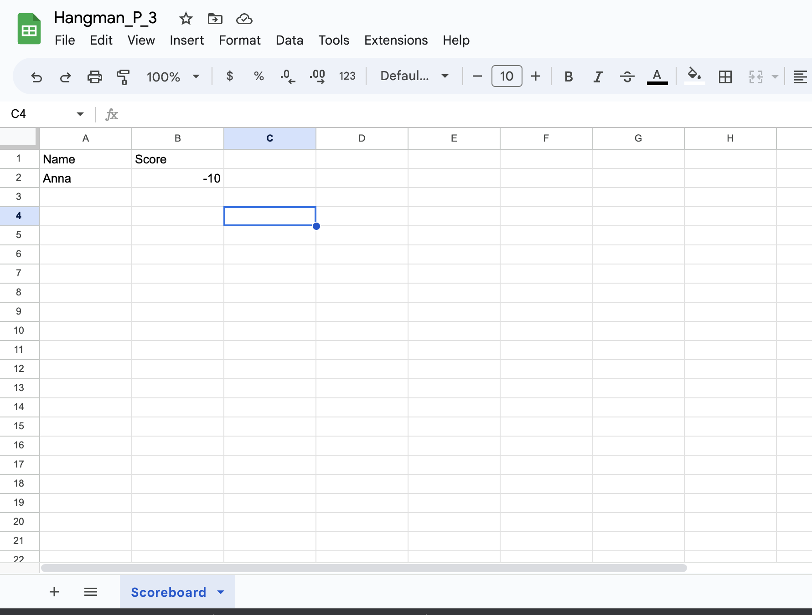

# Hangman
Welcome to the well known universal game of Hangman! Where getting a letter wrong can mean pain of death...
Using python as my main platform I have built this game using both Gitpod and Heroku for my [Code Insitute Tertiary Project.](https://codeinstitute.net/full-stack-software-development-diploma/)

## Index

* [Project Goals](#project-goals)
* [Features](#features)
* [Design](#design)
* [Testing](#testing)
* [Deployment](#deployment)
* [Credits](#credits)

## Project Goals

* To validate players choices through out.
* To show where and how a player went right or wrong.
* To create a sense of competition with other users, and creating a scoreboard function.
* Create direct dialouge to make the game straightforward for a user

I built a flow chart to begin with to help me with what functions I needed to build and what order I should build them where possible. I used [lucidchart](https://www.lucidchart.com/pages/) to create the following:

### User Goals
- Create an ease of use for the player.
- Have a tricky, but not hard time playing the game, and keep it varied.
- Create a username, linked to the scoreboard for added personalisation, potentially for the hope of returning use.
- Give them clear feedback whilst playing the game. 

## Features 
Key Features within this project:

1. I made a scoreboard that adds a username and a point scoreing system to add to the competitiveness of this game. I hoped that the thrill of seeing your name pop up was reminicent of older arcade games, and might users come back to play again, and see who has the highest score.

2. I wanted the game to have a clearing function, so as to not crowd the terminal. I ended up also adding in a timed element to allow the user to read the terminal but not wipe the screen too quickly. 

3. After building the game and running through it a couple of times, I realised that playing a terminal based game can be quite dull with so much black and white space. I looked into how to create colours within the terminal to help elements pop out/ look interesting/ and align with my goal of ease of use. I imported Colorama which allowed me to achieve this.

4. The game constiently tells the user what words they have correctly guessed or what words the have already used. 

5. There is a "lives" counter that repeatedly tells the user how many guesses they have remaining. With, of course, the visual aid of "Hangman" loosing limbs every failed turn. In conjunction with a change of colour to aid visually for people with potential visual impairments. 

## Design 
Whilst desgin for this project was less creative than past projects in terms of web desgin. I still wanted to give the project something to make it not look just like writing in a terminal. Ways in which I achieved this were:
1. Using ASCII Art from [fsymbols](https://fsymbols.com/text-art/) I got the looks of the Hangman intro/WIN/LOOSE fonts to stand out and look impactful. 

2. Creating the desgin for the loosing limbs hangman, to help the user visualise the Lives Lost, and keep track of hpw many tries they have left.

3. Using Colorama, after importing colours to help add definition for different lines of text. Helps to build tension for the user playing the game seeing colour progession. Found thanks to this helpful article [Colorama A Hidden Convenience](https://medium.com/analytics-vidhya/colorama-a-hidden-convinience-6fb22dc00835)

## Testing

  ### All notes related to testing are found [here](documentation/testing.md).

## Credits 
Through-out building I predominantly used my knowledge gained from [Code Institue's Diploma Course](https://codeinstitute.net/full-stack-software-development-diploma/). As well as multiple other sources:

 I went through many different sites to help me with building this app:
 * I was struggling to understand how to do Error handling and this page helped me with learning how to print Error Messages [w3school](https://www.w3schools.com/python/gloss_python_error_handling.asp)
 * Studying further into Booleans was helpful for itteraing through the current letters that had been guessed and checking againt the word itself. This article helped to break it down for me in a bitesized way [Real Python](https://realpython.com/python-in-operator/)

 I was also inspired by these videos:

 After some sick leave I went back to revisit some basics and these challenges from [w3school](https://www.w3schools.com/python/exercise.asp?filename=exercise_ifelse1) were particularly helpful. 
 
