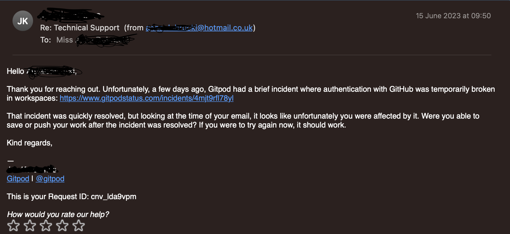
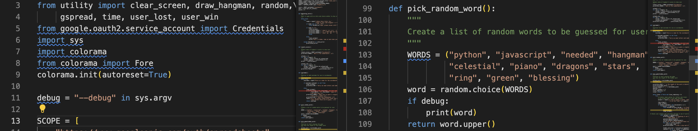
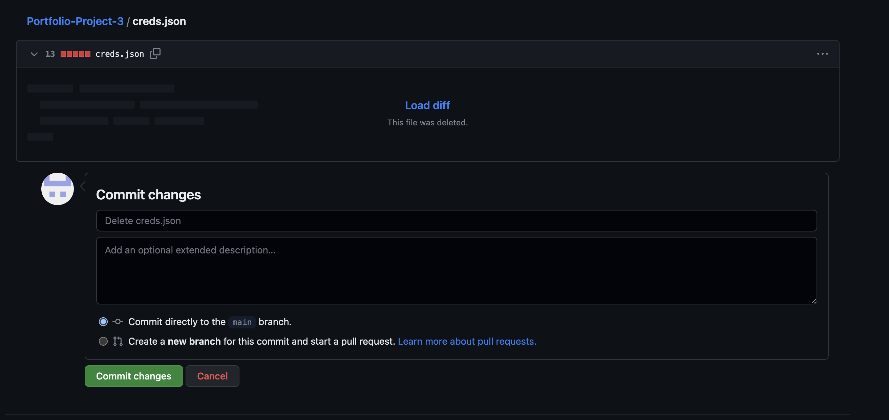
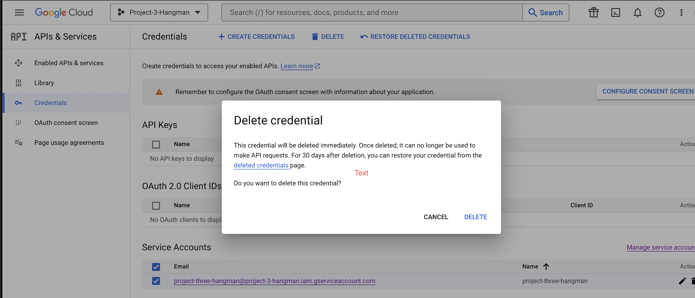
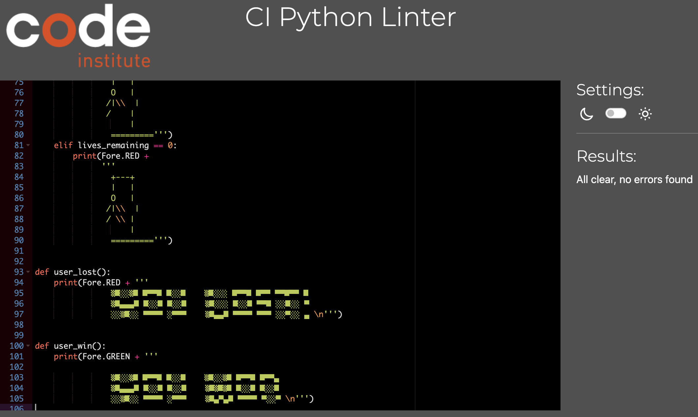
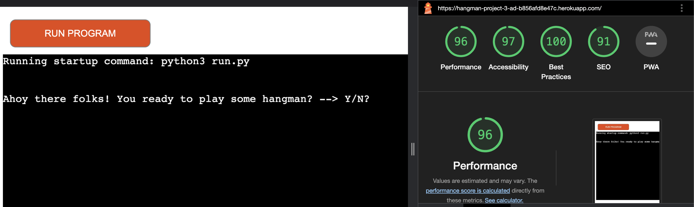
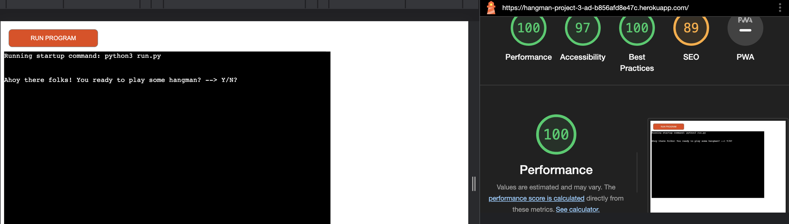

# Testing

## Index

 * [Error resolution and Debugging](#error-resolution-and-debugging)
 * [Manual testing](#manual-testing)
 * [Code Institue Linter testing](#code-institue-linter-testing)
 * [Lighthouse Testing](#lighthouse-testing)

 
  ## Error Resolution and Debugging 
1. Whilst not a problem that had occured from myself, it is worth noting that Gitpod had a authentication issue and meant I was unable to push saved work up to GitHub, this may result in some uncongruent and messy commit messages, see attached email for verification 

2. It took me a couple of goes with the ascII art to realise that I have to break it down into three different print statements to show the images as I wanted them.

3. I was havin trouble with adding the username to the scorebaord as passing through two seperate variables became a problem, so thanks to the mentors at Code Institue I changed to to an array ffirst and passed that through into the update_score function. 

4. After trying to consitently debug my programe for various reasons / testing the flow of the game itself, I realsied that I was having to use print statements all the time but didn't want it to remain in my permenant code. So I figured out how to add a --debug flag into my code so I could use it when I was testing and not worry about it ruining the end game. I used this helpful article to implement it from [OpenSorce](https://opensourceoptions.com/blog/how-to-pass-arguments-to-a-python-script-from-the-command-line/#:~:text=In%20Python%2C%20arguments%20are%20passed,used%20to%20parse%20named%20arguments)

5. Perhaps the biggest debugging I went through was after deployment to Heroku, I realised there was a probelm connecting my creds.json file. After some work I realsied I had named it with a "C" not "c" as intended, this then meant I had to change that. however in the process I had forgotten to rename the file in my .GitIgnore file. Leading to an accidental upload of credentials, after some help from the CI tutors, I deleted the file from GitHub, and had to learn how to pull and consolidate my two threads together. After which I remade a new API, and connected the two up, as well as my Heroku. All of this was a huge learning curve. Helping me to understand the knock on effects of Credentials, as well as helping my foundations of knowledge with API's and pulls from other branches. 

## Manual Testing 

### Start Game

| Test Description (Start Game)   | Expected Outcome | Actual Outcome |
| ----------- | ----------- | ----- |
| Enter 'Y'    | Should move to username question  | Pass
| Enter 'N' | Should give message of nevermind and offer to play again  | Pass
| Enter not 'N' or 'Y' | Give error message / Retry| Pass

### Username 
| Test Description (Username)   | Expected Outcome | Actual Outcome |
| ----------- | ----------- | ----- |
| Enter Username Num & Alpha    | Clear screen/ Explain rules/ Move to Play game function   | Pass
| Enter non Num or Alpha | Error Message / Retry | Pass
| Press Enter | Moves to Play Game Func| Pass

 ### Play Game (included Debug)

| Test Description (Play Game)   | Expected Outcome | Actual Outcome |
| ----------- | ----------- | ----- |
|  Beginning shows spaces | Word has been picked and shown/ Moves to input choice | Pass
| Input Letter Correct | Shows Letters Correct/ Shows on spaces/ Back to input | Pass
| Input Letter Incorrect  | Shows letters guessed/ Back to input/ Shows Hangman and counts down tries  | Pass
| Input Number | Shows Error message / Back to input| Pass
| Input < 1 Letter |Shows error message and letters / Back to input  | Pass
| Input Letter Correct = Word |Shows win message/ Ask for replay  | Pass
| Input Letter Correct = 0 lives |Shows loose message /Shows hidden word/ Ask for replay  | Pass
| Run.py --debug |Displays hidden word | Pass

 ### Replay

| Test Description (Replay)   | Expected Outcome | Actual Outcome |
| ----------- | ----------- | ----- |
|  Replay = "Y" | Goes back to Play Game | Pass
|  Replay = "N" | Thank you message/ Calculate and revel scores/ Update Scoreboard | Pass
|  Replay not "Y" or. "N" | Error Message/ Replay offered| Pass

### Scoreboard

| Test Description (Scoreboard)   | Expected Outcome | Actual Outcome |
| ----------- | ----------- | ----- |
| Username should be updated to scorebaord area | Updated after user is finished with game  | Pass
| After win or loose scores are updated  | Scores show on google sheets in increments of 5| Pass

## Code Institue Linter Testing 

After building the main bulk of my code I started chekcing for errors within the CI Linter. See Below:
1. Run.py 

2. Utility.py

## Lighthouse Testing
* Test Mobile

* Test Desktop - The SEO is mid 80's as I'd need to create some meta data for the site itself, for use in such things like google.

[Return to READme.md](../README.md)

